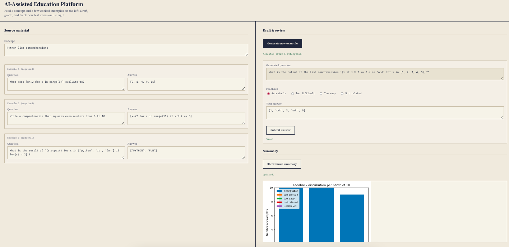

The **AI-Assisted Education Platform** (Item Workbench) is built to bridge the fundamental difference in how artificial intelligence and human beings acquire knowledge.

**The Philosophy & Motivation**

* **AI Needs Context:** Machine learning models excel when provided with clear, structured context and targeted seed examples rather than generic or ambiguous tasks.
* **Humans Learn Through Practice:** Human retention and mastery rely on active recall—solving practice questions repeatedly to reinforce concepts over time.
* **The Synergy:** You feed the platform concise source context and a few worked examples to ground the AI. The AI then acts as an infinite item generator, crafting tailored practice questions for you to test your knowledge repeatedly.

**Key Advantages**

* **Streamlined Learning over Heavy Textbooks:** Instead of sifting through massive textbooks, you only need to supply a core concept summary and 2–3 seed examples to activate complete question generation.
* **Universal Domain Agnostic:** Designed as a general-purpose learning engine suitable for any subject—ranging from Python programming and mathematics to history, medicine, or language studies.
* **Interactive Draft & Review Cycle:** Instantly generate new test items, grade your responses, track difficulty feedback, and refine problem sets in real time.
